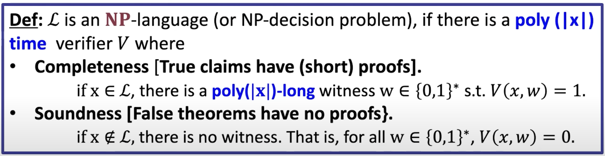

# Introduction to Zero Knowledge Proofs

There are a prover and verifier
`String` = proof submitted by the prover
Verifier rejects or accepts the proof (i.e. the `String`)

In CS we talk about polynomial proofs, that can be verified in **polynomial** time -> **NP proofs**
- The `string` is short
- Polynomial time constraints

`|w|` = polynomial in `|x|`
- The proof `w` of the claim `x` is of polynomial length

**Language L** - a set of binary strings

Class of languages of IP (Interactive Proofs) = { L for which where is an IP }